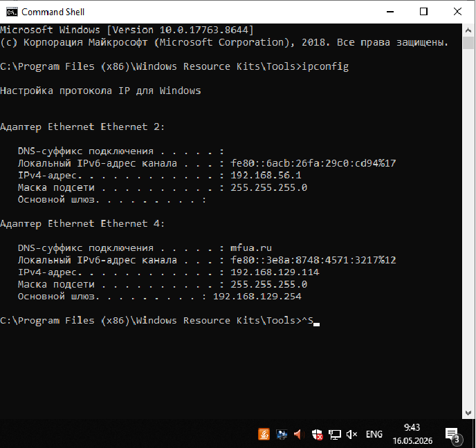
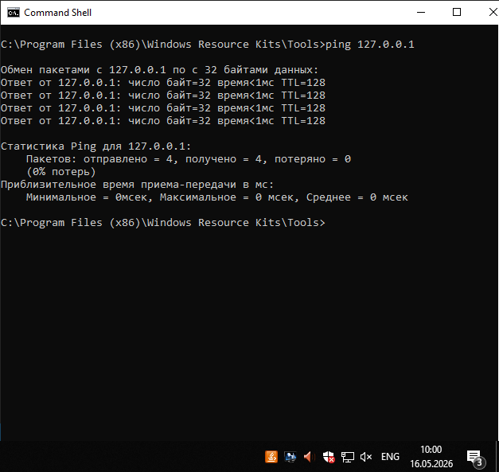
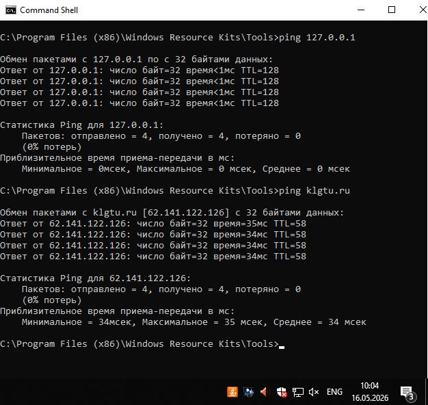
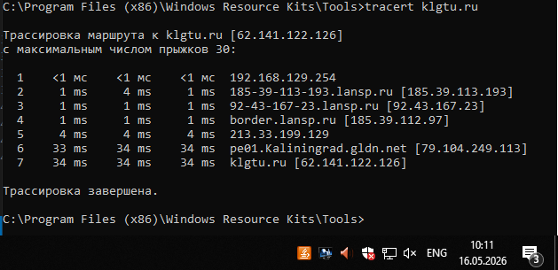
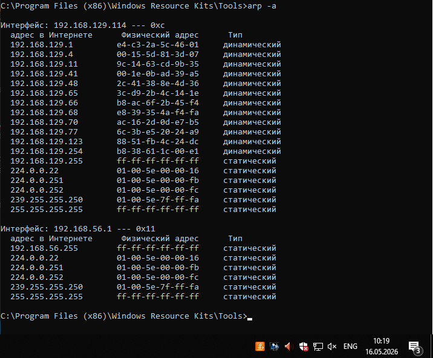
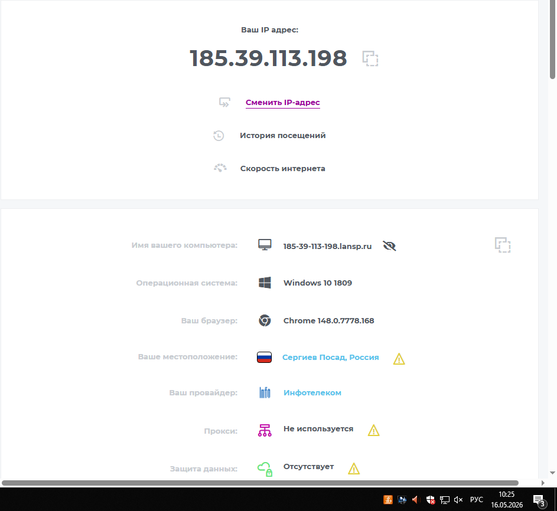

    Лабораторная работа №2 «Изучение программных средств тестирования и определения параметров настройки в компьютерных сетях»

    Цель работы: приобретение знаний и практических навыков в
использовании программного обеспечения для настройки и тестирования
компьютерной сети.

    Материалы, оборудование, программное обеспечение: лаборатория,
оснащенная персональными компьютерами, объединенными в локальную сеть
с доступом в Интернет, утилиты сканирования беспроводных сетей.

Задание 1
Определить IP-адрес локального (своего) компьютера, подключенного к сети.

Рис.1 IP-адрес

Задание 2
Оперделить имя компьютера в локальной сети 

Рис.2 Имя компьютера в локальной сети

Задание 3
Определить скорость передачи информации в компьютерной сети и
наличие связи с узлом.

Рис.3 Тест на корректность работы утилиты

Рис.4 Проверка связи с узлом

Задание 4
Определить маршрут пакетов до заданного узла и получить временные характеристики для каждого промежуточного маршрутизатора на этом пути.

Рис.5 Трассировка маршрута до узла

Задание 5
Определить соответствие локального IP-адреса, физическому(аппаратному) адресу в локальной сети

Задание 6, 7 Пропущены

Задание 8 
Интернет-сервисы тестирования и определения параметров компьютерной сети

